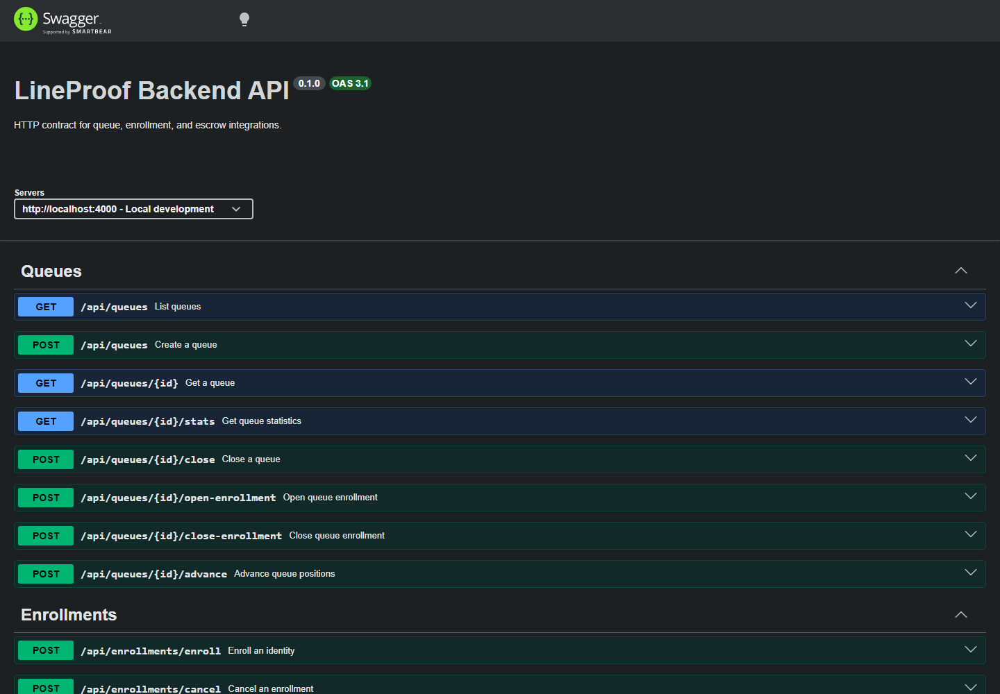

# API reference maintenance

LineProof's OpenAPI document is generated from the same Zod schemas used by
the backend request handlers. Shared request and response schemas live in
`backend/src/schemas/api.ts`; `backend/src/openapi.ts` registers those schemas
and maps them to every public HTTP operation.

## Update the specification

After changing an endpoint or schema, regenerate the checked-in document:

```bash
pnpm --filter @lineproof/backend openapi:generate
```

CI runs the corresponding drift check:

```bash
pnpm --filter @lineproof/backend openapi:check
```

The check generates the document in memory and compares it with
`docs/api-reference/openapi.yaml`. To demonstrate the guard locally, change a
registered description or schema without regenerating the YAML; the command
exits non-zero and asks you to run `openapi:generate`.

## Preview

Run `pnpm --filter @lineproof/backend openapi:preview`, then open
`http://localhost:4100`. A running non-production backend also exposes Swagger
UI at `/api/docs` and the JSON specification at `/api/openapi.json`.



## Versioning policy

The specification is versioned with the backend because they currently share
one release lifecycle. Breaking HTTP changes require a versioned route and a
new API version in the document before the old route is removed. The OpenAPI
artifact should only move to an independent release cycle if clients need to
consume multiple supported backend versions simultaneously.
